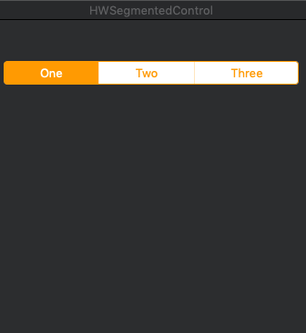

# MYSegmentedControl

[](https://travis-ci.org/330200387@qq.com/MYSegmentedControl)
[](https://cocoapods.org/pods/MYSegmentedControl)
[](https://cocoapods.org/pods/MYSegmentedControl)
[](https://cocoapods.org/pods/MYSegmentedControl)

## Example

To run the example project, clone the repo, and run `pod install` from the Example directory first.

## Requirements

## Installation

MYSegmentedControl is available through [CocoaPods](https://cocoapods.org). To install
it, simply add the following line to your Podfile:

```ruby
pod 'MYSegmentedControl'
```

## Author

330200387@qq.com, 330200387@qq.com

## License

MYSegmentedControl is available under the MIT license. See the LICENSE file for more info.

swift

        let sege = HWSegmentedControl()
        sege.titles = ["One","Two","Three"]        
        sege.frame = NSRect(x: 150, y: 300, width: 200, height: 26)
        self.window.contentView?.addSubview(sege)
        
OC

@property (nonatomic, strong) HWSegmentedControl  *sege;


    self.sege = [HWSegmentedControl new];
    self.sege.titles = @[@"One",@"Two",@"Three",];

    self.sege.borderWidth = 1;
    [self.window.contentView addSubview:self.sege];
    self.sege.delegate = self;
    self.sege.frame = CGRectMake(150, 300, 200, 26);
 //代理
- (void)selectTitleIndex:(NSInteger)index
{
    NSLog(@"选择了第%ld个标签",index);
}
